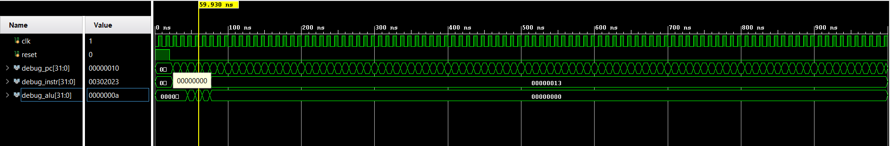
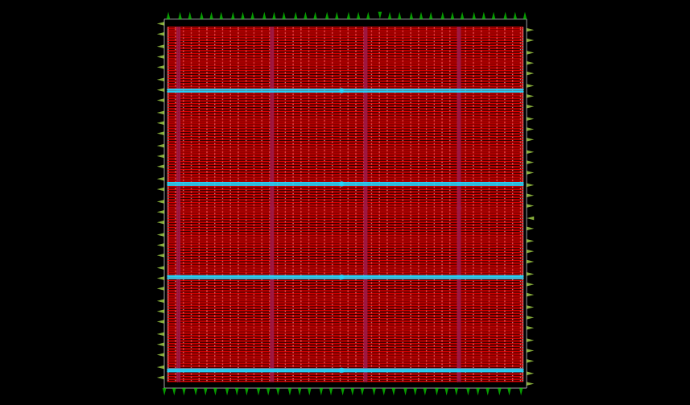
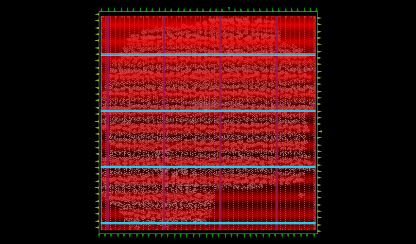
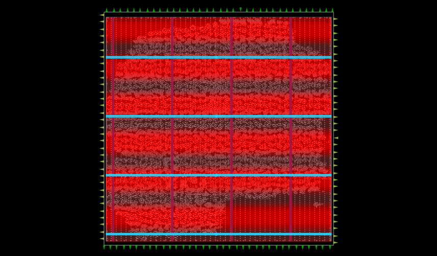
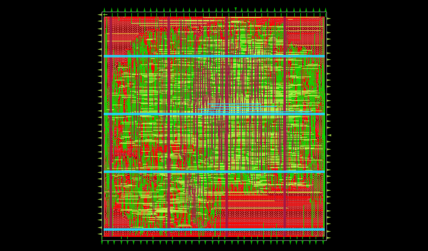
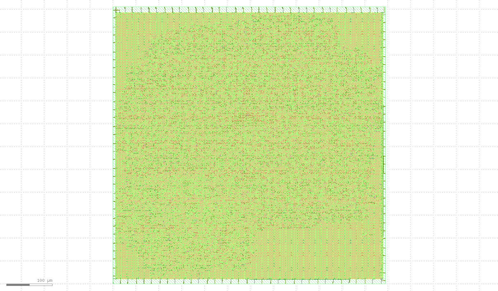

# 32-bit RV32I RISC-V Processor — RTL to GDSII

A complete implementation of a **32-bit RV32I RISC-V pipelined processor** in Verilog, followed by functional verification, RTL synthesis, physical design, timing analysis, and final **GDSII generation** using the Sky130A open-source ASIC flow.

## Project Overview

This project implements a 32-bit RISC-V processor based on the **RV32I instruction set architecture** using a pipelined microarchitecture.

The design includes:

* 5-stage pipeline architecture
* RV32I instruction execution
* Arithmetic and logical operations
* Register file
* Immediate generation
* Instruction and data memory
* Hazard detection
* Data forwarding
* Pipeline control
* ALU
* Branch and memory operations

## Processor Pipeline

The processor follows the conventional 5-stage pipeline:

```text
IF → ID → EX → MEM → WB
```

Where:

* **IF** — Instruction Fetch
* **ID** — Instruction Decode / Register Read
* **EX** — Execute / ALU
* **MEM** — Memory Access
* **WB** — Write Back

Hazard detection and forwarding logic are implemented to handle data dependencies between instructions.

## RTL Simulation

The processor was functionally verified using **Xilinx Vivado**.

The simulation testbench exercises basic RV32I instructions including register operations and memory access.



## ASIC Implementation Flow

The verified RTL was taken through a complete RTL-to-GDSII ASIC implementation flow using the **Sky130A PDK**.

```text
RTL
 │
 ▼
RTL Simulation
 │
 ▼
Yosys Synthesis
 │
 ▼
Floorplanning
 │
 ▼
Placement
 │
 ▼
Clock Tree Synthesis
 │
 ▼
Routing
 │
 ▼
Static Timing Analysis
 │
 ▼
DRC Verification
 │
 ▼
GDSII
```

### Tools Used

* Verilog HDL
* Xilinx Vivado
* Yosys
* OpenLane
* OpenROAD
* Sky130A PDK
* KLayout
* Git / GitHub

## Physical Design Results

### 1. Floorplan

Initial physical organization of the processor core and standard-cell region.



### 2. Placement

Standard cells placed within the core area.



### 3. Clock Tree Synthesis

Clock distribution network generated during CTS.



### 4. Routing

Completed physical routing of the design.



### 5. Final GDSII Layout

Final chip layout generated after physical implementation and signoff.



## Final Implementation

The final ASIC implementation successfully completed the OpenLane flow with:

* **Zero setup timing violations**
* **Zero hold timing violations**
* **Zero DRC violations**
* Successful GDSII generation
* Sky130A `sky130_fd_sc_hd` standard-cell library

The final GDSII and DEF files are available in the `results/` directory.

## Repository Structure

```text
.
├── README.md
├── .gitignore
│
├── rtl/
│   ├── riscv_pipeline_top.v
│   ├── rv32i_alu.v
│   ├── rv32i_control.v
│   ├── rv32i_forward_hazard.v
│   ├── rv32i_imm_gen.v
│   ├── rv32i_mem.v
│   └── rv32i_regfile.v
│
├── simulation/
│   └── tb_riscv.v
│
├── openlane/
│   └── config.json
│
├── results/
│   ├── riscv_pipeline_top.gds
│   └── riscv_pipeline_top.def
│
└── docs/
    ├── vivado_simulation.png
    ├── floorplan.png
    ├── placement.png
    ├── cts.png
    ├── routing.png
    └── final_gds.png
```

## ASIC Configuration

The implementation uses:

```text
PDK:                Sky130A
Standard Cell:      sky130_fd_sc_hd
Clock Period:       10 ns
Clock Port:         clk
Core Utilization:   35%
Target Placement:   45%
```

32-bit RV32I RISC-V Processor — RTL to GDSII ASIC Implementation
